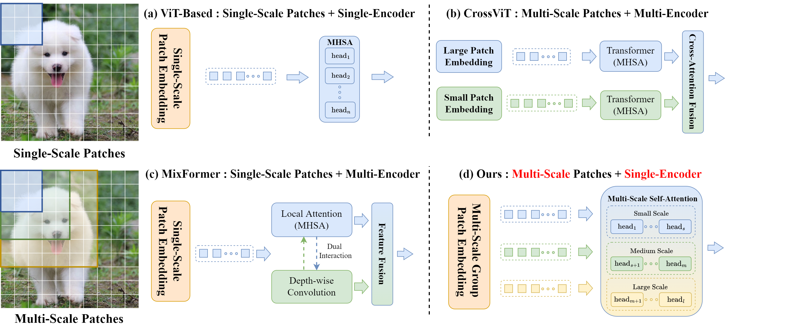

# ScopeViT: Scale-Aware Vision Transformer

## Introduction
Multi-scale features are crucial for a wide range of vision tasks, *e.g.*, classification, detection, and segmentation. Although Vision Transformers (ViTs) show remarkable success in capturing global features within an image, how to leverage multi-scale features in Transformers is not well explored. In this paper, we propose a novel transformer-CNN hybrid architecture called ScopeViT, which computes multi-scale attention to capture multi-granularity representations spontaneously. Via embedding visual tokens of different receptive fields into distinct attention heads, ScopeViT could "see" various scales throughout the entire network. This novel attention scheme enables our model to effectively learn inter-object relationships across varying scales while reducing the number of tokens involved in attention computation. Our experiments demonstrate that ScopeViT achieves competitive complexity/accuracy trade-offs compared to existing networks across different tasks such as image classification, object detection, and instance segmentation. On the ImageNet-1K dataset, ScopeViT achieves a top-1 accuracy of 81.1%, using only 7.4 million parameters and 2.0 GFLOPs. Our approach outperforms Swin (ViT-based) by 1.9% accuracy while saving 42% of the parameters, outperforms MobileViTv2 (Hybrid-based) with a 0.7% accuracy gain while using 50% of the computations, and also beats ConvNeXtv2 (ConvNet-based) by 0.8% with fewer parameters.

## Main Results
| Model                              | Params (M) | GFLOPs | Resolution | Top-1 (%) | Reference |
|------------------------------------|------------|--------|------------|-----------|-----------|
| Swin-2G         | 12.8       | 2.0    | 224        | 79.2      | ICCV21    |
| DeiT-S   | 22.1       | 4.6    | 224        | 79.8      | ICML21    |
| PVT-Small   | 24.5       | 3.8    | 224        | 79.8      | ICCV21    |
| P2T-T             | 11.6       | 1.8    | 224        | 79.8      | TPAMI22   |
| Shunted-T    | 11.5       | 2.1    | 224        | 79.8      | CVPR22    |
| EViT-S(Keep rate=0.6) | 22.1 | 3.5 | 256      | 80.0      | ICLR22    |
| ConvNeXt V2-P | 9.1      | 1.4    | 224        | 80.3      | arXiv23   |
| MobileViTv2-1.5 | 10.6 | 4.0 | 256      | 80.4      | arXiv22   |
| CoaT Mini          | 10.0       | 6.8    | 224        | 80.8      | ICCV21    |
| MPViT-XS       | 10.5       | 2.9    | 224        | 80.9      | CVPR22    |
| *CrossViT-S* | 26.7     | 5.6    | 224        | 81.0      | ICCV21    |
| **ScopeViT-T**                     | 7.4        | 2.0    | 256        | **81.1**  |           |

## License

This project is released under the [Apache 2.0 license](LICENSE).

## Acknowledgement

Our implementation is mainly based on the following codebases. We gratefully thank the authors for their wonderful works.

- [pytorch-image-models (timm)](https://github.com/rwightman/pytorch-image-models): PyTorch image models, scripts, pretrained weights.
- [PoolFormer](https://github.com/sail-sg/poolformer): Official PyTorch implementation of MetaFormer.
- [ConvNeXt](https://github.com/facebookresearch/ConvNeXt): Official PyTorch implementation of ConvNeXt.
- [OpenMixup](https://github.com/Westlake-AI/openmixup): Open-source toolbox for visual representation learning.
- [MMDetection](https://github.com/open-mmlab/mmdetection): OpenMMLab Detection Toolbox and Benchmark.
- [MMSegmentation](https://github.com/open-mmlab/mmsegmentation): OpenMMLab Semantic Segmentation Toolbox and Benchmark.
- [MMPose](https://github.com/open-mmlab/mmpose): OpenMMLab Pose Estimation Toolbox and Benchmark.
- [MMHuman3D](https://github.com/open-mmlab/mmhuman3d): OpenMMLab 3D Human Parametric Model Toolbox and Benchmark.

(<a href="#top">back to top</a>)

